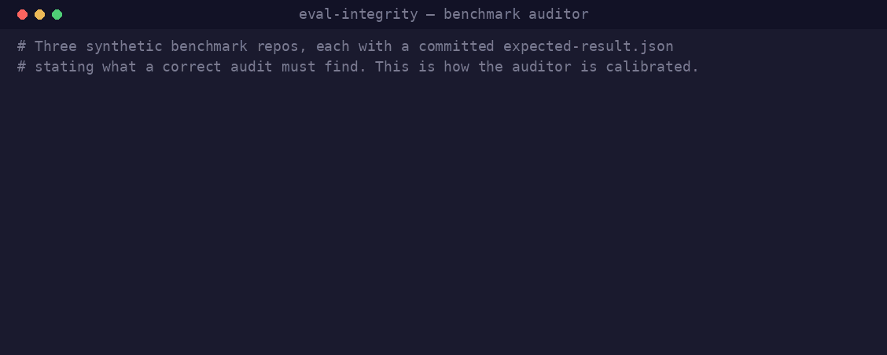

# eval-integrity

**If you published this benchmark's numbers, would they survive an adversarial reviewer?**

<p align="center">
  
</p>

Most benchmark repos have a runner and a leaderboard but lack the integrity scaffolding that makes a published score mean what it appears to mean. `eval-integrity` is a read-only auditor for LLM evaluation and benchmark repos. It checks for that scaffolding across seven dimensions, names what is missing, rates whether each gap *invalidates a published number* or merely *hardens credibility*, and emits both a markdown report and a machine-readable `result.json`.

It never edits your benchmark, re-runs an eval, or touches a leaderboard. It reports and offers fixes; applying them is your call.

## The seven dimensions

Each maps to a way a benchmark's numbers get dismissed in review. Each has its own [methodology file](methodology/) with individually-scoreable sub-checks — so a finding is "CT5 (no published holdout gap) is ABSENT," not a vague "contamination: partial."

| # | Dimension | The question it asks | Defeats |
|---|-----------|----------------------|---------|
| 1 | [Pre-registration](methodology/pre-registration.md) | Is the run's definition fixed on disk *before* results exist? | "You re-ran until it looked good." |
| 2 | [Contamination](methodology/contamination.md) | Are corpus authors (and their family) barred as contestants? Is there a private holdout with a published gap? | "The author's model graded the author's exam." |
| 3 | [Holdout hygiene](methodology/holdout-hygiene.md) | Can holdout content leak via CI logs, artifacts, transcripts, or errors? | "Your private set is in your CI logs." |
| 4 | [Judge validity](methodology/judge-validity.md) | Is the judge pinned to the served model? Chance-corrected agreement? Same-lab, length, halo controls? | "Your judge drifted / favors its own family / rewards length." |
| 5 | [Statistical honesty](methodology/statistical-honesty.md) | Do headline numbers carry CIs? Micro vs macro? pass@k vs pass^k? Multiplicity? | "That ranking is sampling noise." |
| 6 | [Reproducibility](methodology/reproducibility.md) | Deterministic re-run path, cost caps/resume, pinned environment? | "No one can re-run this." |
| 7 | [Leaderboard & publishing](methodology/leaderboard-publishing.md) | Are null-agent/holdout/non-default rows kept out by tripwire tests, and does the publish path ship what the docs promise? | "A do-nothing agent ranks mid-board" / "the table your docs promise is never written." |

A benchmark that passes all seven is one whose headline number a skeptical reviewer has to take seriously.

## How it scores

- Every **sub-check** is scored independently: **PRESENT** (implemented AND enforced in code or a test), **PARTIAL** (documented or half-built, not enforced), **ABSENT** (no evidence), or **N/A**. Sub-checks roll up to a dimension status; dimensions roll up to a verdict (`publish_ready` / `gradable_with_caveats` / `not_publish_ready`).
- Every gap carries a **severity** — **INVALIDATING** (a reviewer can throw out the number) or **HARDENING** (weakens credibility, doesn't invalidate) — and a **concrete fix** (the file to add, the guard to write, the test to add).
- Evidence is mandatory: a `file:line` for every finding, or an explicit "searched X, Y, Z — found nothing."
- **A grep miss is not proof of ABSENT.** The methodology grep patterns carry one benchmark's vocabulary; your repo may call the same concept something else (a holdout named a "sequestered split", a judge named a "grader"). The auditor searches by *concept* — reading the scoring entry points, CI, and docs — before rating anything ABSENT.

## Install

Copy the skill directory into your project — that is the whole installation:

```bash
cp -r . your-project/.claude/skills/eval-integrity
```

Then run `/eval-integrity` from (or pointed at) a benchmark repo. Or run it straight from a clone: `/eval-integrity /path/to/benchmark`. The directory name becomes the command; `methodology/`, `schema/`, and `fixtures/` ride along and load only when the audit runs.

## Fixtures — the credibility proof

An auditor you can't calibrate is just an opinion. [`fixtures/`](fixtures/) holds three small, obviously-synthetic benchmark repos (fake project names like `acme-agent-bench`) with an `expected-result.json` for each, stating what a correct audit should find:

- [`weak-benchmark/`](fixtures/weak-benchmark/) — violates most dimensions (test data committed, no seed, the judge is also a contestant, a cherry-picked leaderboard). Expected verdict: `not_publish_ready`.
- [`hardened-benchmark/`](fixtures/hardened-benchmark/) — mixed: pre-registration and null-agent exclusion are solid; agreement is not chance-corrected, the author guard is exact-match-only, several tables are unwired. Expected verdict: `gradable_with_caveats`.
- [`publish-ready-benchmark/`](fixtures/publish-ready-benchmark/) — passes all seven. It deliberately calls its holdout a **"sequestered split"** so a purely grep-based auditor would falsely score the holdout checks ABSENT — the fixture exercises the concept-search rule. Expected verdict: `publish_ready`.

Run the audit against each fixture and diff its `result.json` against the `expected-result.json` to check the auditor is calibrated.

## Schema & CI trend-tracking

Every audit writes a `result.json` conforming to [`schema/result.schema.json`](schema/result.schema.json): `{audited_commit, date, verdict, dimensions: {<name>: {status, severity, sub_checks: [{id, status, evidence: [{file, line, note}], fix}]}}}`. Because it is per-sub-check and diffable, a benchmark can commit each audit and track its integrity trend over time — catch a regression the day a refactor drops a tripwire test, not the day a reviewer does.

## Origin

Extracted and upgraded from hardening a private agent benchmark for grant review — the seven dimensions are the attacks that review surfaced. The framework was generalized: no repo-specific paths, and the single-status-per-dimension scoring was split into individually-scoreable sub-checks.

## License

MIT — see [LICENSE](LICENSE).
